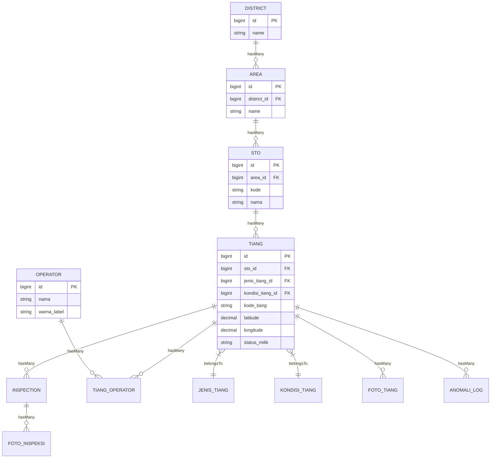
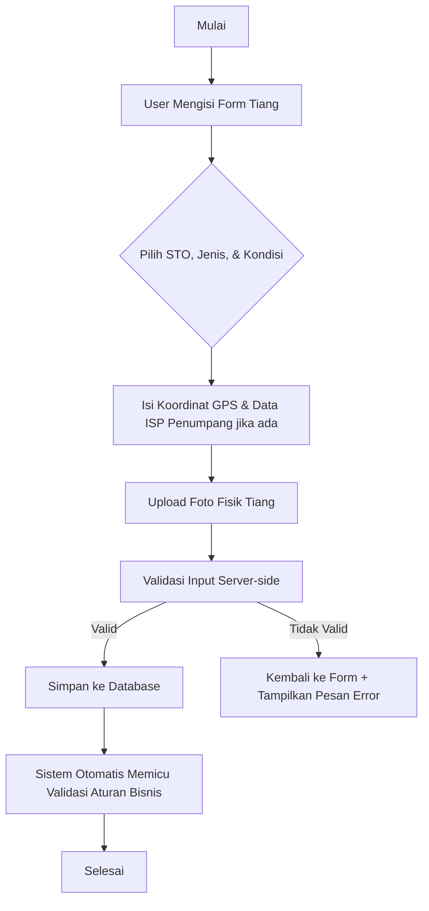
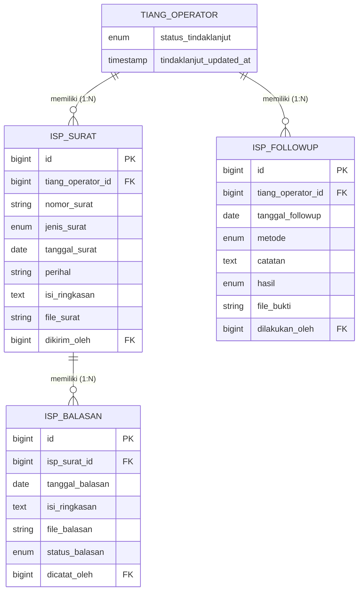

# Dokumentasi Sistem Informasi Monitoring dan Validasi Data Tiang Telekomunikasi Berbasis Web GIS Di PT Telkom Infrastruktur Indonesia District Lampung

Sistem ini adalah platform berbasis web yang digunakan untuk mendata, memantau, memvalidasi kepatuhan aturan bisnis, serta menganalisis kondisi fisik serta legalitas tiang telekomunikasi di bawah wilayah kerja PT Telkom Infrastruktur Indonesia District Lampung.

---

## 1. Teknologi yang Digunakan (Tech Stack)

### **Backend**
*   **Framework Core:** Laravel 11/13 (PHP 8.3)
*   **Database:** PostgreSQL (`pgsql`)
*   **Excel Parser (Import):** `SimpleXLSX` (untuk membaca file Excel secara cepat dengan memori efisien menggunakan metode *Batch Processing*)
*   **Excel Generator (Export):** `PhpOffice\PhpSpreadsheet` (untuk membuat file Excel/CSV/PDF secara realtime)

### **Frontend**
*   **Template Engine:** Laravel Blade Templating
*   **UI Framework:** Bootstrap 5 (Custom CSS)
*   **Peta Interaktif:** Leaflet.js (untuk menampilkan titik koordinat GPS tiang di peta digital/Web GIS)
*   **Grafik & Visualisasi:** Chart.js (untuk memvisualisasikan statistik tiang dan status verifikasi di halaman dashboard)
*   **Client Scripting:** jQuery & Vanilla JavaScript (untuk manipulasi DOM dinamis dan AJAX request)

---

## 2. Struktur Database & Relasi

Aplikasi ini menggunakan relasi database berjenjang untuk mendefinisikan wilayah kerja tiang:

### **Penjelasan Relasi Utama:**
*   **District:** Regional wilayah tingkat tertinggi (contoh: Lampung).
*   **Area:** Sub-wilayah di dalam district (contoh: Area Metro).
*   **STO (Sentral Telepon Otomat):** Node jaringan telekomunikasi yang berasosiasi dengan area (contoh: Kedaton - KDT).
*   **Tiang Telekomunikasi:** Aset fisik tiang yang ditempatkan di bawah naungan STO tertentu.
*   **ISP Penumpang (Operator):** Penyedia layanan internet lain yang menyewa/menumpang kabel pada tiang Telkom.

---

## 3. Alur Kerja Utama Aplikasi (Application Flow)

### **A. Alur Manajemen Data Tiang (CRUD Tiang)**

### **B. Alur Import Data Tiang via Excel (Batch Processing)**
Proses import didesain untuk menangani data dalam skala besar secara aman menggunakan metode pemrosesan batch dan transaksi database (transaction rollbacks) jika terjadi kegagalan fatal:
1.  **Upload File:** Admin mengunggah template Excel melalui halaman `Import Excel`.
2.  **Validasi Format:** Sistem memeriksa integritas file menggunakan parser `SimpleXLSX`.
3.  **Baris per Baris (Looping & Batch):**
    *   Sistem mencari / membuat STO sesuai kode di Excel secara otomatis.
    *   Sistem mendeteksi kolom `Jenis Tiang`. Jika terdapat jenis tiang baru yang belum ada di database (dan kolom tidak kosong), sistem akan otomatis menambahkannya ke tabel master `jenis_tiang`. Jika kolom kosong, sistem akan menggunakan jenis tiang pertama sebagai fallback.
    *   Memeriksa apakah `Kode Tiang` sudah ada di database (mencegah redundansi data).
    *   Validasi koordinat GPS (apakah latitude & longitude valid secara geografis).
4.  **Pencatatan Kesalahan (Error Logging):** Jika ada baris data yang tidak memenuhi kriteria validasi, sistem mencatat detail kesalahan (nomor baris & kolom yang salah) ke dalam tabel `import_history_errors` agar dapat diunduh oleh admin untuk diperbaiki.

### **C. Alur Validasi Aturan Bisnis Otomatis**
Sistem memiliki modul validasi otomatis untuk memverifikasi integritas data tiang berdasarkan aturan bisnis Telkom:
*   **Kriteria Pelanggaran Aturan Bisnis (Data Tidak Valid):**
    1.  **Kondisi Fisik NOK (Miring/Keropos):** Tiang dengan kondisi fisik di bawah standar kelayakan (Level keparahan: "Rusak" atau "Perlu Perhatian").
    2.  **Dokumentasi Tidak Lengkap (Tanpa Foto):** Tiang aktif yang tidak memiliki data dokumentasi foto fisik tiang.
    3.  **Kelebihan Kapasitas ISP Penumpang:** Jumlah kabel operator lain/kompetitor yang menumpang melebihi kapasitas standar tiang.
    4.  **Legalitas ISP Belum Jelas:** ISP non-predefined yang menumpang kabel tanpa rincian identitas sewa yang valid.
*   **Alur Eksekusi Validasi:**
    Setiap kali tiang dibuat atau diperbarui, job validasi akan berjalan secara sinkronus untuk memeriksa kondisi tiang tersebut. Jika ditemukan pelanggaran aturan, catatan pelanggaran akan dimasukkan ke dalam tabel `anomali_log` (log ketidaksesuaian data) untuk disajikan di dashboard utama sebagai indikator tindak lanjut verifikasi.

---

## 4. Pembagian Peran Pengguna (Role & Permissions)

*   **Administrator (Admin):**
    *   Memiliki akses penuh untuk mengelola master data regional (District, Area, STO).
    *   Dapat mengimpor data tiang via Excel (pemrosesan batch) dan melakukan ekspor data laporan.
    *   Mengelola akun pengguna dan hak akses sistem.
*   **Teknisi Lapangan (Teknisi):**
    *   Dapat menambahkan data tiang baru langsung dari lapangan.
    *   Dapat memperbarui data koordinat GPS, kondisi fisik tiang, dan memperbarui foto inspeksi.
    *   Tidak dapat menghapus data tiang atau memodifikasi data master regional.

---

## 5. Optimalisasi Performa & Keamanan Sistem (Terbaru)

### **A. Optimalisasi Database & Query (Performa)**
*   **Database Indexing:** Menambahkan index pada foreign keys (`sto_id`, `jenis_tiang_id`, `kondisi_tiang_id`, `district_id`, `area_id`) serta kolom filter (`status_verifikasi`, `has_anomali` / status validitas data, `status_legalitas`) untuk mempercepat query filtering dan JOIN.
*   **Eager Loading Policy:** Menyalakan `Model::preventLazyLoading(!app()->isProduction())` untuk secara otomatis melempar error saat development jika terdeteksi query N+1, menjamin efisiensi runtime query.
*   **Dashboard Caching:** Mengimplementasikan cache data statistik dashboard selama 5 menit (`300` detik) dengan cache key unik berbasis parameter filter daerah & tanggal.
*   **TiangObserver (Cache Invalidation):** Cache dashboard otomatis di-invalidasi ketika terjadi perubahan data tiang (tambah, edit, hapus, pulihkan) menggunakan pendekatan versioning timestamp cache key.

### **B. Keamanan Perimeter & Upload File**
*   **SecurityHeadersMiddleware:** Menambahkan HTTP headers wajib (`Content-Security-Policy`, `X-Frame-Options: SAMEORIGIN`, `X-Content-Type-Options: nosniff`, `Referrer-Policy`, `X-XSS-Protection`) secara global.
*   **Validasi Upload Foto:** 
    *   Mencegah *MIME confusion attack* dengan membaca MIME asli menggunakan extension `finfo` server, bukan hanya ekstensi nama file.
    *   Mengacak nama file fisik menggunakan UUID (`Str::uuid()`) demi menghindari serangan *file upload traversal*.
*   **Rate Limiting:**
    *   **Login Protection:** Membatasi login hingga 5 kali percobaan per menit per email+IP.
    *   **API Protection:** Membatasi API GIS & Dropdowns (60 requests/menit), API Write (30 requests/menit), dan Import status (5 requests/menit) untuk menangkal DDoS/scraping.
*   **Session Idle Timeout:** Menambahkan middleware `session.timeout` yang memaksa logout jika tidak ada aktivitas selama 120 menit.
*   **Password Policy:** Mengatur standard minimum password yang kompleks secara global (minimal 8 karakter, wajib memiliki huruf besar, huruf kecil, angka, dan simbol).

### **C. Pemeliharaan & Monitoring (Maintenance)**
*   **Scheduler Backup Database:** Menyediakan command `php artisan db:backup` yang memicu `pg_dump` PostgreSQL secara otomatis setiap pukul 01:00 pagi dengan retensi logis 7 hari (backup lama dihapus otomatis).
*   **Health Check Endpoint (`/health`):** Endpoint JSON public terenkripsi dan terproteksi rate limiter untuk memonitor status kesehatan Database, Cache, dan Storage.

---

## 6. Fitur Heatmap & Persentase Statistik (Terbaru)

### **A. Peta Sebaran Heatmap (Kerapatan Kepadatan)**
*   **API Endpoint (`GET /api/tiang/heatmap`)**:
    *   Menerima parameter filter wilayah dan parameter wajib `type` (`tiang` atau `anomali` / data menyimpang).
    *   Mengoptimalkan performa rendering browser dengan mengelompokkan data sebaran GPS menggunakan pembulatan presisi `ROUND(latitude::numeric, 3)` dan `ROUND(longitude::numeric, 3)`. Backend hanya mengirimkan titik teragregasi beserta bobot kerapatan (`weight`).
*   **Interaktivitas UI**:
    *   Tersedia tombol toggle **"Marker Cluster" / "Heatmap"** yang responsif pada card peta dashboard.
    *   Dropdown tipe heatmap (**"Heatmap: Tiang"** dan **"Heatmap: Data Menyimpang"**) akan muncul hanya saat mode Heatmap aktif.
    *   Menggunakan library **Leaflet.heat** yang dinamis dan terintegrasi penuh dengan seluruh filter pencarian & regional.

### **B. Statistik Persentase & Visualisasi Baru**
*   **Metrik Persentase Realtime**:
    *   Setiap metrik utama (Kondisi Fisik Bermasalah, Pelanggaran Aturan Bisnis Aktif, Menunggu Verifikasi) kini menampilkan nilai persentase terhadap total tiang dengan format angka Indonesia (pemisah desimal koma, misal: `9,84%`).
    *   Grafik Donut Kondisi menampilkan persentase langsung pada legenda dan tooltip untuk pemahaman cepat.
*   **Tabel Persentase per STO**:
    *   Menampilkan data STO, Jumlah Tiang, Jumlah Pelanggaran Aturan, dan Persentase Ketidaksesuaian Data.
    *   Diurutkan secara descending (`anomali_percent` terbesar di atas) untuk membantu admin memprioritaskan inspeksi wilayah dengan tingkat penyimpangan data tertinggi.
    *   Baris STO dengan tingkat ketidaksesuaian data **> 10%** otomatis diberi highlight visual berwarna merah muda tipis (`#fee2e2`).
*   **Grafik Baru (Breakdown Verifikasi & Legalitas ISP)**:
    *   **Breakdown Verifikasi**: Grafik donut baru yang menampilkan rincian persentase status verifikasi tiang (OK, Pending, Ditolak, Double Input).
    *   **Legalitas ISP**: Grafik donut baru yang menampilkan status legalitas ISP penumpang kabel tiang (Legal, Perlu Verifikasi, Ilegal).
*   **Keamanan Content Security Policy (CSP)**:
    *   Domain CDN eksternal untuk leaflet-heat (`https://cdn.jsdelivr.net`) telah didaftarkan dengan aman pada `SecurityHeadersMiddleware.php` bagian `script-src` dan `connect-src`.

---

## 7. Modul Tindak Lanjut ISP Penumpang (ISP Passenger Follow-up System)

Modul ini memfasilitasi administrasi PT Telkom untuk mencatat, melacak, dan menindaklanjuti ISP/Operator pihak ketiga yang menumpangkan kabel telekomunikasinya secara ilegal atau tidak berizin pada aset tiang Telkom.

### **A. Struktur Tabel Database Baru & Hubungannya**
Sistem menggunakan 3 tabel baru serta 1 modifikasi kolom pada tabel pivot `tiang_operator`:

*   **`isp_surat`**: Menyimpan data surat resmi (Pemberitahuan, Peringatan 1/2/3, Tagihan, dll.) yang dilayangkan kepada ISP pelanggar.
*   **`isp_balasan`**: Menyimpan rekam tanggapan dari pihak ISP terhadap surat yang dikirimkan.
*   **`isp_followup`**: Log aktivitas tindak lanjut langsung di lapangan atau meja perundingan (rapat, whatsapp, kunjungan langsung).
*   **`status_tindaklanjut`** (pada `tiang_operator`): State machine utama status hubungan legalisasi ISP di tiang.

---

### **B. State Machine & Alur Perubahan Status Otomatis**
Logika transisi status diatur secara terpusat di dalam class `App\Services\TindakLanjutService` dengan ketentuan alur berikut:

1.  **Belum Disurati (Default):** Belum ada surat (`isp_surat`) yang tercatat dikirim ke ISP untuk tiang tersebut.
2.  **Sudah Disurati:** Minimal ada 1 surat yang dikirim, belum ada balasan, dan durasi sejak surat terakhir kurang dari **14 hari** (nilai default).
3.  **Perlu Follow-up:** Belum ada balasan, tetapi durasi sejak surat terakhir dikirim sudah **>= 14 hari** (memerlukan tindakan kejar/follow-up oleh admin).
4.  **Ada Balasan:** ISP telah mengirimkan tanggapan surat (`isp_balasan` terkait).
5.  **Selesai (Hard-Lock Manual):** Status ini diatur secara manual oleh Administrator jika proses sewa/tertib kabel telah disepakati dan legal. Sekali status diatur ke `selesai`, status dikunci dan tidak akan berubah secara otomatis oleh kalkulasi sistem (State Lock Override).

*Semua perubahan status ini dipicu secara real-time via Eloquent model events saat surat, balasan, atau follow-up dibuat atau diubah.*

---

### **C. Optimalisasi Performa & UX Modul Tindak Lanjut**
*   **Anti N+1 Queries (Strict Eager Loading):** Untuk mencegah overhead query berantai pada halaman timeline dan detail, controller menggunakan strict loading untuk merelasikan user pencatat (`dikirimOleh`, `dicatatOleh`, `dilakukanOleh`).
*   **Sidebar Notification Badge:** Menampilkan badge jumlah kasus berstatus `Perlu Follow-up` secara real-time. Untuk mencegah overhead database, data ini disimpan di cache Redis/File dengan key `tindaklanjut_perlu_followup_count` dan otomatis dihapus (`Cache::forget`) setiap kali status berubah.
*   **Asynchronous Timeline View:** Menggunakan modular AJAX partials (`tindaklanjut/partials/timeline.blade.php`) untuk me-refresh riwayat surat menyurat secara dinamis tanpa melakukan reload halaman penuh.

---

## 8. Penyempurnaan Alur Navigasi & UI Tambahan

*   **Pemisah Grid Dashboard:** Sesuai permintaan visual, letak panel info total District dan Area pada dashboard telah ditukar agar visualisasi alur cakupan operasional lebih intuitif.
*   **Akses Kembali Landing Page:** Halaman autentikasi login kini dilengkapi dengan tombol "Kembali ke Beranda" untuk mempermudah navigasi publik kembali ke landing page tanpa perlu menggunakan tombol back browser.
*   **Peningkatan Kontras Teks Footer:** Warna tulisan judul pada footer landing page ("TIF District Lampung" & "ALAMAT") dipaksa menjadi putih solid menggunakan flag `!important` untuk menimpa class warna bawaan dari berkas global `design-system.css`, memastikan keterbacaan yang optimal pada latar belakang gelap.

