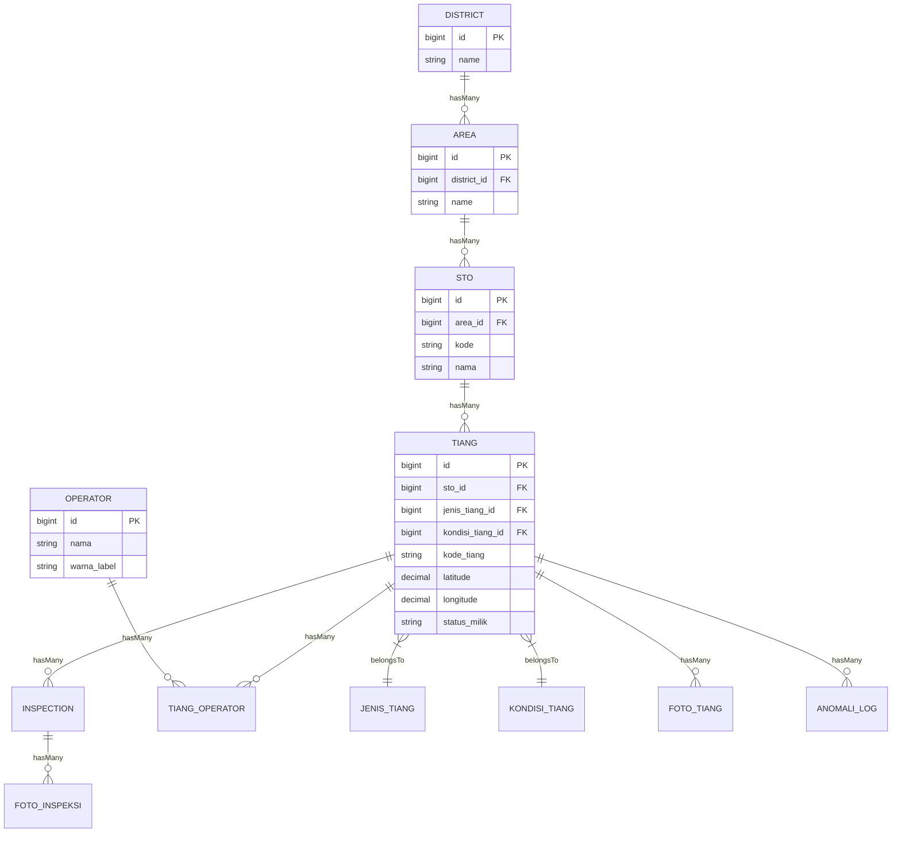
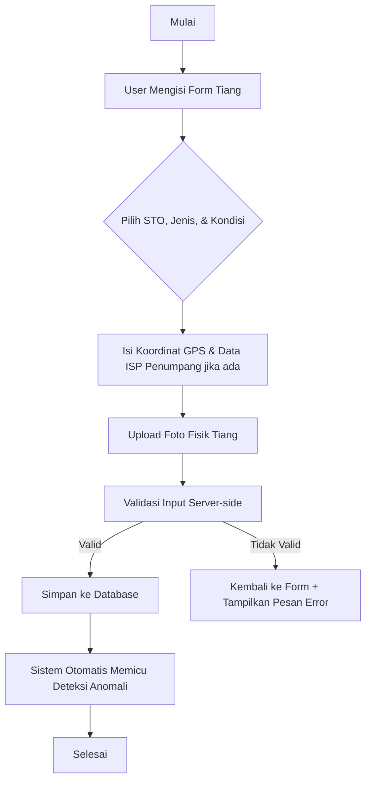

# Dokumentasi Sistem Monitoring Infrastruktur Tiang (PT Telkom Infrastruktur)

Sistem ini adalah platform berbasis web yang digunakan untuk mendata, memantau, dan menganalisis kondisi fisik serta legalitas tiang telekomunikasi di bawah wilayah kerja PT Telkom Infrastruktur.

---

## 1. Teknologi yang Digunakan (Tech Stack)

### **Backend**
*   **Framework Core:** Laravel 11/13 (PHP 8.3)
*   **Database:** PostgreSQL (`pgsql`)
*   **Excel Parser (Import):** `SimpleXLSX` (untuk membaca file Excel secara cepat dengan memori efisien)
*   **Excel Generator (Export):** `PhpOffice\PhpSpreadsheet` (untuk membuat file Excel/CSV/PDF secara realtime)

### **Frontend**
*   **Template Engine:** Laravel Blade Templating
*   **UI Framework:** Bootstrap 5 (Custom CSS)
*   **Peta Interaktif:** Leaflet.js (untuk menampilkan titik koordinat GPS tiang di peta digital)
*   **Grafik & Visualisasi:** Chart.js (untuk memvisualisasikan statistik tiang di halaman dashboard)
*   **Client Scripting:** jQuery & Vanilla JavaScript (untuk manipulasi DOM dinamis dan AJAX request)

---

## 2. Struktur Database & Relasi

Aplikasi ini menggunakan relasi database berjenjang untuk mendefinisikan wilayah kerja tiang:

### **Penjelasan Relasi Utama:**
*   **District:** Regional wilayah tingkat tertinggi (contoh: Lampung).
*   **Area:** Sub-wilayah di dalam district (contoh: Area Metro).
*   **STO (Sentral Telepon Otomat):** Node jaringan telekomunikasi yang berasosiasi dengan area (contoh: Kedaton - KDT).
*   **Tiang Telekomunikasi:** Aset fisik tiang yang ditempatkan di bawah naungan STO tertentu.
*   **ISP Penumpang (Operator):** Penyedia layanan internet lain yang menyewa/menumpang kabel pada tiang Telkom.

---

## 3. Alur Kerja Utama Aplikasi (Application Flow)

### **A. Alur Manajemen Data Tiang (CRUD Tiang)**

### **B. Alur Import Data Tiang via Excel**
Proses import didesain untuk menangani ribuan data secara aman menggunakan transaction rollbacks jika terjadi kegagalan fatal:
1.  **Upload File:** Admin mengunggah template Excel melalui halaman `Import Excel`.
2.  **Validasi Format:** Sistem memeriksa integritas file menggunakan parser `SimpleXLSX`.
3.  **Baris per Baris (Looping):**
    *   Sistem mencari / membuat STO sesuai kode di Excel.
    *   Memeriksa apakah `Kode Tiang` sudah ada di database (mencegah duplikat).
    *   Validasi koordinat GPS (apakah latitude & longitude valid).
4.  **Error Logging:** Jika ada baris yang tidak valid, sistem mencatat detail error (nomor baris & kolom yang salah) ke dalam tabel `import_history_errors` agar bisa didownload oleh admin untuk diperbaiki.

### **C. Alur Deteksi Anomali Otomatis**
Sistem memiliki mesin pemeriksa otomatis untuk menjaga kebersihan data aset tiang:
*   **Kondisi Pemicu Anomali:**
    1.  **Tiang Miring/Keropos:** Tiang dengan kondisi fisik di bawah standar (Level keparahan: "Rusak" atau "Perlu Perhatian").
    2.  **Tanpa Foto:** Tiang aktif yang tidak memiliki data dokumentasi foto fisik.
    3.  **Kelebihan Kapasitas ISP:** Jumlah operator penumpang melebihi kapasitas standar tiang.
*   **Alur Eksekusi:**
    Setiap kali tiang dibuat atau diperbarui, `RunAnomalyDetectionJob` akan berjalan secara sinkronus (realtime/sync) untuk memeriksa kondisi tiang tersebut. Jika ditemukan pelanggaran aturan, catatan pelanggaran akan masuk ke dalam tabel `anomaly_logs` untuk ditampilkan pada dashboard utama.

---

## 4. Pembagian Peran Pengguna (Role & Permissions)

*   **Administrator (Admin):**
    *   Memiliki akses penuh untuk mengelola master data wilayah (District, Area, STO).
    *   Dapat mengimpor data tiang via Excel dan melakukan ekspor data secara massal.
    *   Mengelola user dan hak akses sistem.
*   **Teknisi Lapangan (Teknisi):**
    *   Dapat menambahkan data tiang baru langsung dari lapangan.
    *   Dapat mengubah/mengedit koordinat GPS, kondisi fisik tiang, dan memperbarui foto inspeksi.
    *   Tidak dapat menghapus data tiang atau memodifikasi data master regional.

---

## 5. Optimalisasi Performa & Keamanan Sistem (Terbaru)

### **A. Optimalisasi Database & Query (Performa)**
*   **Database Indexing:** Menambahkan index pada foreign keys (`sto_id`, `jenis_tiang_id`, `kondisi_tiang_id`, `district_id`, `area_id`) serta kolom filter (`status_verifikasi`, `has_anomali`, `status_legalitas`) untuk mempercepat query filtering dan JOIN.
*   **Eager Loading Policy:** Menyalakan `Model::preventLazyLoading(!app()->isProduction())` untuk secara otomatis melempar error saat development jika terdeteksi query N+1, menjamin efisiensi runtime query.
*   **Dashboard Caching:** Mengimplementasikan cache data statistik dashboard selama 5 menit (`300` detik) dengan cache key unik berbasis parameter filter daerah & tanggal.
*   **TiangObserver (Cache Invalidation):** Cache dashboard otomatis di-invalidasi ketika terjadi perubahan data tiang (insert, update, delete, restore) menggunakan pendekatan versioning timestamp cache key.

### **B. Keamanan Perimeter & Upload File**
*   **SecurityHeadersMiddleware:** Menambahkan HTTP headers wajib (`Content-Security-Policy`, `X-Frame-Options: SAMEORIGIN`, `X-Content-Type-Options: nosniff`, `Referrer-Policy`, `X-XSS-Protection`) secara global.
*   **Validasi Upload Foto:** 
    *   Mencegah *MIME confusion attack* dengan membaca MIME asli menggunakan extension `finfo` server, bukan hanya ekstensi nama file.
    *   Mengacak nama file fisik menggunakan UUID (`Str::uuid()`) demi menghindari serangan *file upload traversal*.
*   **Rate Limiting:**
    *   **Login Protection:** Membatasi login hingga 5 kali percobaan per menit per email+IP.
    *   **API Protection:** Membatasi API GIS & Dropdowns (60 requests/menit), API Write (30 requests/menit), dan Import status (5 requests/menit) untuk menangkal DDoS/scraping.
*   **Session Idle Timeout:** Menambahkan middleware `session.timeout` yang memaksa logout jika tidak ada aktivitas selama 120 menit.
*   **Password Policy:** Mengatur standard minimum password yang kompleks secara global (minimal 8 karakter, wajib memiliki huruf besar, huruf kecil, angka, dan simbol).

### **C. Pemeliharaan & Monitoring (Maintenance)**
*   **Scheduler Backup Database:** Menyediakan command `php artisan db:backup` yang memicu `pg_dump` PostgreSQL secara otomatis setiap pukul 01:00 pagi dengan retensi logis 7 hari (backup lama dihapus otomatis).
*   **Health Check Endpoint (`/health`):** Endpoint JSON public terenkripsi dan terproteksi rate limiter untuk memonitor status kesehatan Database, Cache (Redis/DB), dan Storage (Local/S3).

---

## 6. Fitur Heatmap & Persentase Statistik (Terbaru)

### **A. Peta Sebaran Heatmap**
*   **API Endpoint (`GET /api/tiang/heatmap`)**:
    *   Menerima parameter filter wilayah dan parameter wajib `type` (`tiang` atau `anomali`).
    *   Mengoptimalkan performa rendering browser dengan mengelompokkan data sebaran GPS menggunakan pembulatan presisi `ROUND(latitude::numeric, 3)` dan `ROUND(longitude::numeric, 3)`. Backend hanya mengirimkan titik teragregasi beserta bobot kerapatan (`weight`).
*   **Interaktivitas UI**:
    *   Tersedia tombol toggle **"Marker Cluster" / "Heatmap"** yang responsif pada card peta dashboard.
    *   Dropdown tipe heatmap (**"Heatmap: Tiang"** dan **"Heatmap: Anomali"**) akan muncul hanya saat mode Heatmap aktif.
    *   Menggunakan library **Leaflet.heat** yang dinamis dan terintegrasi penuh dengan seluruh filter pencarian & regional.

### **B. Statistik Persentase & Visualisasi Baru**
*   **Metrik Persentase Realtime**:
    *   Setiap metrik utama (Kondisi NOK, Anomali Aktif, Menunggu Verifikasi) kini menampilkan nilai persentase terhadap total tiang dengan format angka Indonesia (pemisah desimal koma, misal: `9,84%`).
    *   Grafik Donut Kondisi menampilkan persentase langsung pada legenda dan tooltip untuk pemahaman cepat.
*   **Tabel Persentase per STO**:
    *   Menampilkan data STO, Jumlah Tiang, Jumlah Anomali, dan Persentase Anomali.
    *   Diurutkan secara descending (`anomali_percent` terbesar di atas) untuk membantu admin memprioritaskan inspeksi wilayah bermasalah.
    *   Baris STO dengan tingkat anomali **> 10%** otomatis diberi highlight visual berwarna merah muda tipis (`#fee2e2`).
*   **Grafik Baru (Breakdown Verifikasi & Legalitas ISP)**:
    *   **Breakdown Verifikasi**: Grafik donut baru yang menampilkan rincian persentase status verifikasi tiang (OK, Pending, Ditolak, Double Input).
    *   **Legalitas ISP**: Grafik donut baru yang menampilkan status legalitas ISP penumpang kabel tiang (Legal, Perlu Verifikasi, Ilegal).
*   **Keamanan Content Security Policy (CSP)**:
    *   Domain CDN eksternal untuk leaflet-heat (`https://cdn.jsdelivr.net`) telah didaftarkan dengan aman pada `SecurityHeadersMiddleware.php` bagian `script-src` dan `connect-src`.

