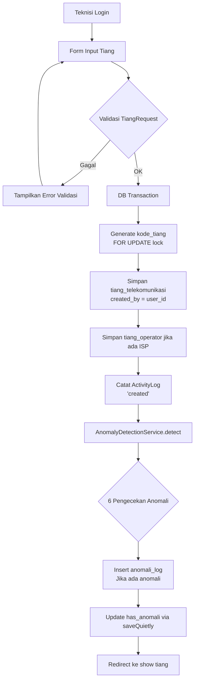
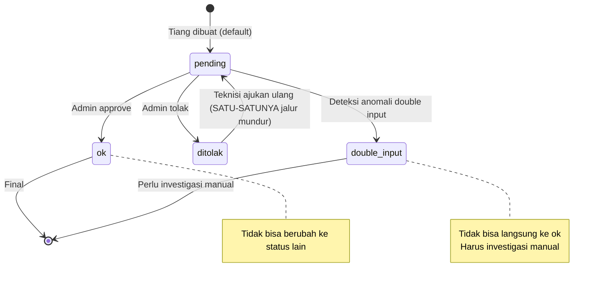
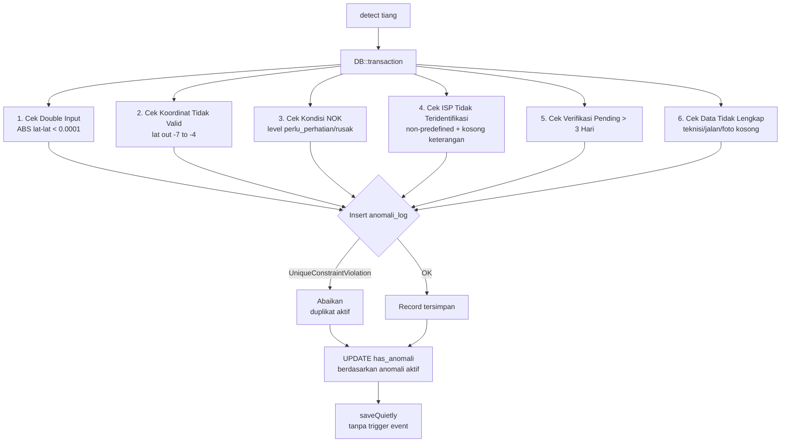
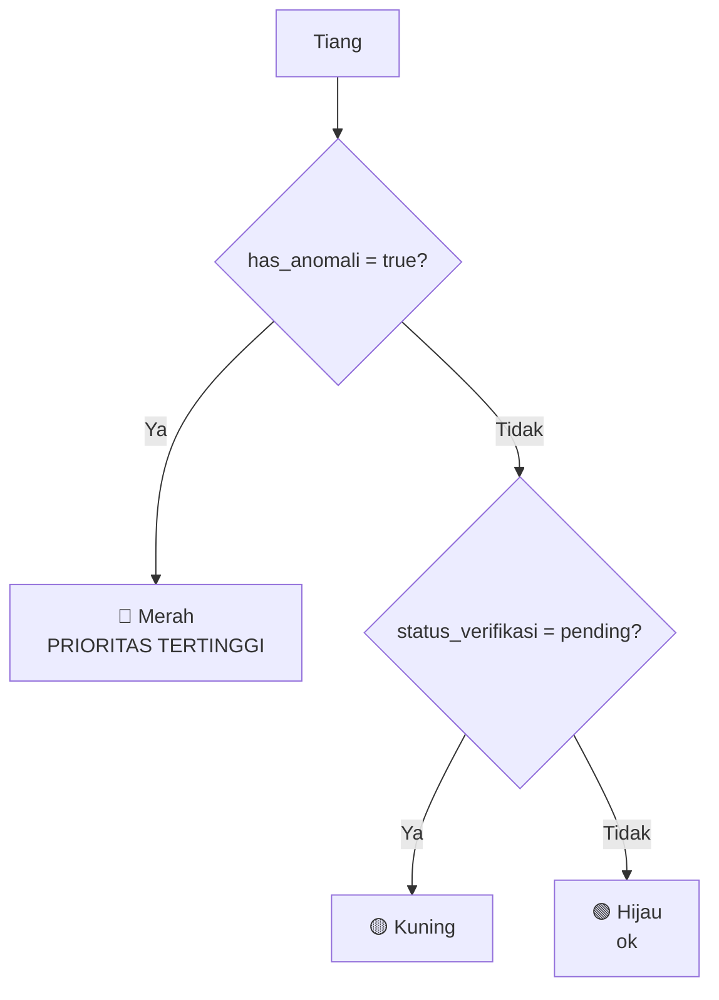

# ALUR SISTEM — Monitoring Infrastruktur Tiang Telekomunikasi

## 1. Alur Input Data Tiang (Manual via Web)



## 2. Alur Import Data Excel

```mermaid
flowchart TD
    A[Admin Upload File Excel] --> B[Simpan ImportHistory\nstatus=processing]
    B --> C[Dispatch ImportJob ke Queue]
    C --> D[Frontend polling /api/import/{id}/progress\nsetiap 3 detik]
    D --> E[Job berjalan di background]
    E --> F[Baca baris Excel per baris]
    F --> G{Validasi baris}
    G -- Error --> H[ImportHistoryError::create\nraw_data = JSON baris]
    G -- OK --> I[Proses & Simpan Tiang]
    I --> J[Update progress_percent\nsetiap 50 baris]
    J --> G
    I --> K[Setelah semua baris]
    K --> L[Update ImportHistory\nstatus=done/failed]
    L --> M[Dispatch RunAnomalyDetectionJob]
    M --> N[Detect anomali batch tiang baru]
```

## 3. Alur Verifikasi Tiang (State Machine)



## 4. Alur Deteksi Anomali (AnomalyDetectionService)



## 5. Alur Export Data

```mermaid
flowchart TD
    A[User Request Export] --> B{Format?}
    B -- PDF --> C{Jumlah baris}
    C -- "> 1000" --> D[Return 422\nGunakan Excel]
    C -- "<= 1000" --> E[Generate PDF\nDomPDF]
    B -- Excel --> F[Generate XLSX\nPhpSpreadsheet]
    B -- CSV --> G[Generate CSV\nUTF-8 BOM]

    E & F & G --> H[Simpan ke storage/exports/{user_id}/]
    H --> I[TTL 24 jam\nCleanup otomatis]
```

## 6. Prioritas Warna Marker Peta (Leaflet)


