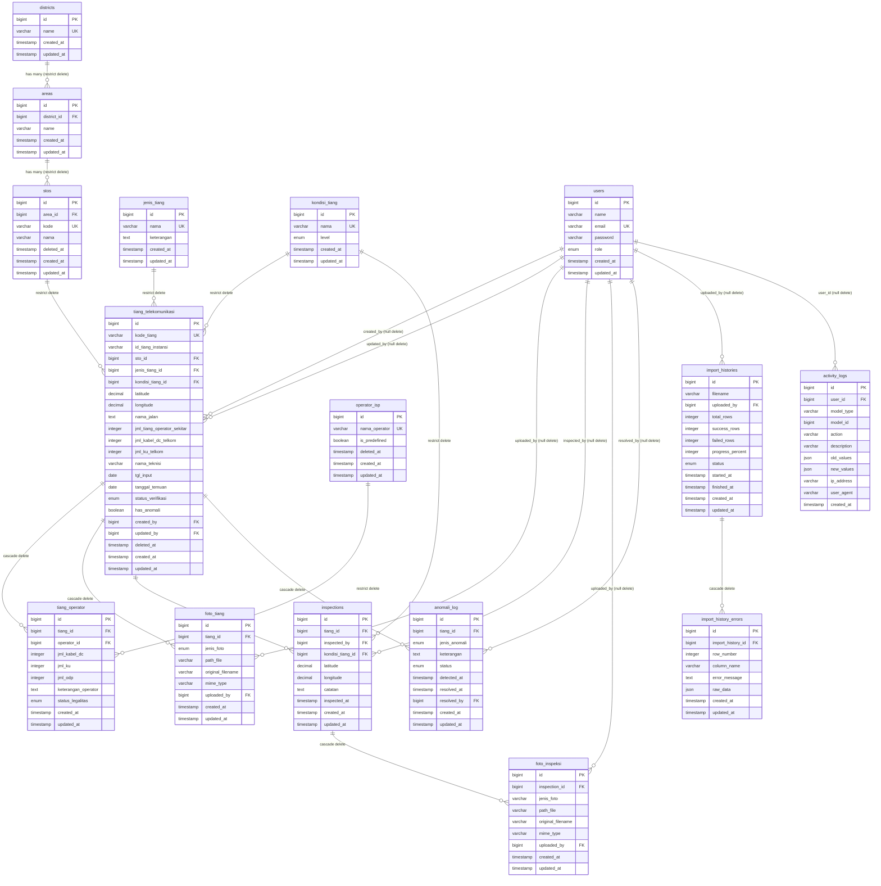

# ERD — Monitoring Infrastruktur Tiang Telekomunikasi

> Diagram ini mencakup seluruh 16 tabel sistem. Dibuat menggunakan Mermaid erDiagram.



## Keterangan Kolom Penting

| Tabel | Kolom | Keterangan |
|-------|-------|-----------|
| `tiang_telekomunikasi` | `kode_tiang` | Auto-generate: `TI-{STO_KODE}-{NNNNN}` via DB transaction + lockForUpdate |
| `tiang_telekomunikasi` | `id_tiang_instansi` | Partial unique index (NULL diabaikan di PostgreSQL) |
| `tiang_telekomunikasi` | `has_anomali` | **READONLY** — hanya `AnomalyDetectionService` yang boleh ubah |
| `tiang_telekomunikasi` | `status_verifikasi` | State machine: pending↔ok, pending↔ditolak, pending→double_input |
| `anomali_log` | `jenis_anomali` | 6 nilai: double_input, isp_tidak_teridentifikasi, kondisi_nok, verifikasi_pending, koordinat_tidak_valid, data_tidak_lengkap |
| `anomali_log` | *(partial unique)* | `UNIQUE (tiang_id, jenis_anomali) WHERE status = 'aktif'` |
| `activity_logs` | `model_type` | Alias tetap (bukan FQCN): tiang, inspection, foto_tiang, dll |

## Catatan PostGIS (belum dieksekusi)

```sql
-- Aktifkan PostGIS
CREATE EXTENSION IF NOT EXISTS postgis;

-- Tambah kolom geometry
ALTER TABLE tiang_telekomunikasi ADD COLUMN geom geometry(Point, 4326);

-- Isi dari kolom decimal yang ada
UPDATE tiang_telekomunikasi
SET geom = ST_SetSRID(ST_MakePoint(longitude, latitude), 4326);

-- Index spatial
CREATE INDEX idx_tiang_geom ON tiang_telekomunikasi USING GIST(geom);

-- Kolom decimal TETAP dipertahankan paralel — aplikasi tidak perlu diubah
```
